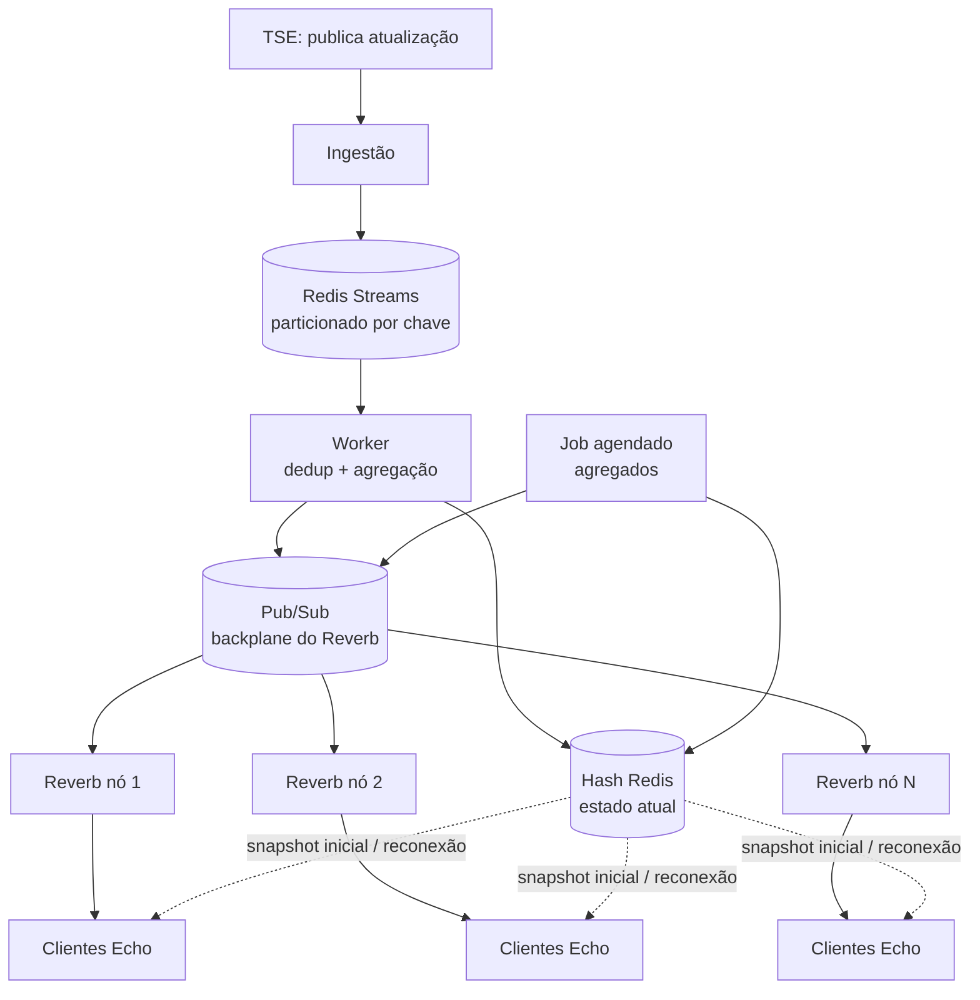

# Parte 2: Perguntas de Arquitetura

## Contexto

A empresa quer evoluir o produto para notificar, em tempo real, mais de 500 mil
usuários conectados simultaneamente sobre a apuração de uma eleição. O TSE
publica atualizações conforme elas ocorrem (por município, urna, cargo,
candidato) e o sistema precisa refletir essas atualizações para todos os
usuários assim que forem publicadas.

A resposta abaixo desenvolve os mesmos conceitos de arquitetura orientada a
eventos, mas já aterrissados numa stack concreta: **Redis Streams** como
broker de eventos, **Redis Pub/Sub** como camada de fan-out interno, e
**Laravel Reverb** (com **Horizon** para observabilidade) como cluster de
gateways WebSocket.

## Visão geral do fluxo

## 1. Ingestão e propagação de eventos

**Ingestão.** Uma rota/controller recebe o webhook do TSE e despacha um Job
que normaliza a atualização num evento canônico:
`{município, urna, cargo, candidato, votos, timestamp, versão}`. O número de
versão é gerado por esse Job, com um contador monotônico por chave
(`município+urna+cargo`), não assumido da fonte.

**Broker: Redis Streams.** Uso um número fixo de streams (ex. 64),
particionados por hash da chave de negócio. Não uso um stream por urna: isso
geraria centenas de milhares de streams simultâneos numa eleição nacional
(~500 mil urnas). É o mesmo princípio das partições do Kafka: um número
pequeno e fixo de streams, cada um recebendo várias chaves, em vez de um
stream por entidade. A mesma chave sempre cai na mesma partição, e a
ingestão publica ali com `XADD`.

Isso garante ordenação **dentro** da partição sem precisar de ordem global
entre urnas diferentes. Cada entrada recebe um ID sequencial gerado pelo
próprio Redis, e uma partição pode ser relida desde o começo: é isso que dá
replay e retenção, diferente de um `PUBLISH`/`SUBSCRIBE` puro do Redis, onde
a mensagem se perde se ninguém estiver ouvindo no momento.

**Processamento: Queue Worker.** Como as 64 partições são um número fixo e
conhecido, os Workers se dividem essas streams entre si (cada Worker fica
responsável por um subconjunto fixo), então não precisam descobrir streams
dinamicamente, diferente do que aconteceria com um stream por urna. Cada
Worker lê sua fatia via consumer group, que guarda automaticamente o offset
de leitura por partição. O Worker deduplica, aplica idempotência (seção 2),
calcula agregações (totais por candidato, % apurado) e escreve o resultado
num hash Redis, a *materialized view*. Essa chave é por entidade (uma por
urna+cargo), o que é normal pra um hash Redis: barato, sem o overhead de
consumer group. O que não escala é ter um stream+consumer-group por
entidade; por isso a partição fixa acima.

**Distribuição: Reverb.** O Worker dispara um evento de broadcast, que o
Laravel Broadcasting envia via API HTTP pro nó Reverb configurado pro app.
Esse nó publica o evento no Redis Pub/Sub (o *scaling backplane* do Reverb),
e os demais nós Reverb, inscritos nesse mesmo canal, recebem e repassam só
para os clientes Echo conectados a cada um deles. Horizon é usado aqui pra
monitorar a fila de jobs de broadcast e detectar acúmulo antes que vire
atraso visível pro usuário.

## 2. Padrões e garantias de entrega

O padrão de base é **Redis Streams como log durável com consumer groups**,
não Pub/Sub puro: isso dá at-least-once nativo (entrada não confirmada fica
pendente até ser reentregue) e a possibilidade de replay.

**Ordenação:** garantida só dentro de cada partição/stream (a mesma chave
`município+urna+cargo` sempre cai na mesma partição). Esse é o único nível
em que ordenação importa aqui; não há necessidade de ordem global entre
partições diferentes.

**Idempotência:** o Worker compara o campo `versao` do evento recebido com a
versão já salva no hash Redis antes de aplicar; se não for maior, descarta.
Essa checagem (ler e depois escrever) não é atômica. Em operação normal não
é um problema, porque cada partição é consumida por um único Worker por vez
(seção 1). O único cenário onde essa checagem poderia rodar de forma
concorrente para a mesma entrada é um reclaim (seção 4), enquanto o Worker
original ainda está processando. Para fechar esse gap eu faria a checagem e
a escrita como uma operação atômica única no Redis (ex. via script Lua), em
vez de dois comandos separados.

Isso protege contra:

1. Redelivery do Streams: se o Worker cai antes de confirmar o
   processamento, o Redis reentrega a mesma entrada; sem essa checagem, o
   total seria contado em dobro.
2. Cliente reconectando: busca o snapshot atual no endpoint de "apuração
   atual" (que lê do hash Redis) **e** ainda recebe pelo canal do Reverb
   alguns eventos que já estavam nesse snapshot.
3. Retry de rede na ingestão, reenviando a mesma atualização do TSE.

**At-least-once (nativo do Streams) + idempotência = exactly-once efetivo**,
sem pagar o custo de coordenação distribuída que um exactly-once real
exigiria. É suficiente porque o que importa é o estado final por chave, não
a contagem de mensagens em si.

## 3. Escala e tempo real para 500 mil+ conexões simultâneas

**Transporte:** WebSocket via Reverb como canal principal. O uso aqui é
unidirecional (servidor → cliente), então SSE seria um fallback equivalente
para redes que bloqueiam WebSocket (via streaming de resposta HTTP do
Laravel), embora o Reverb não ofereça isso nativamente hoje.

**Escala horizontal:** múltiplas instâncias do Reverb atrás de um load
balancer, todas compartilhando o mesmo Redis como scaling backplane. Cada nó
só conhece as conexões que ele mesmo aceitou; escalar é subir mais nós
Reverb, sem coordenação forte entre eles. No cliente, Laravel Echo assina
canais **públicos** segmentados por tópico (ex. por UF e cargo), sem exigir
autorização por usuário. Assim, cada usuário só recebe as
atualizações que está acompanhando, o que corta volume desnecessário de
mensagens por nó. Um canal privado obrigaria o cliente a chamar
`/broadcasting/auth` a cada subscribe (inclusive em toda reconexão, já que o
Echo reautentica ao resubscrever): um round-trip HTTP síncrono a mais por
cliente, incompatível com a escala aqui.

**Backpressure e picos de carga:**

- *Coalescing por chave*: cada entrada processada do Stream ainda dispara um
  broadcast individual (seção 1). Não agrupo atualizações da mesma urna num
  buffer, porque isso exigiria estado em memória por partição dentro do
  Worker, e prefiro manter o Worker stateless e reiniciável a qualquer
  momento (se cair, o pior caso é mais uma reentrega, não a perda de um
  buffer de coalescing). O custo é aceitável: uma urna não reporta múltiplas
  vezes por segundo, então o volume real de coalescing necessário está nos
  agregados abaixo, não nos eventos brutos por urna.
- *Agregados derivados com granularidade limitada*: métricas caras de
  recalcular a cada evento (ranking nacional, % apurado por UF) não são
  recomputadas por evento. Um job agendado pelo Scheduler do Laravel (com
  lock pra evitar sobreposição) lê o estado mais recente do hash Redis e
  dispara um único broadcast agregado. A granularidade mínima nativa do
  Scheduler é de 1 em 1 minuto; um daemon customizado chegaria a janelas de
  recomputação mais curtas (ex. 500ms a 1s), mas aceito essa granularidade
  mais grossa aqui. O que precisa ser de fato tempo real é a atualização por
  urna, que já sai a cada evento sem essa limitação; o ranking nacional pode
  esperar o próximo minuto.
- *Monitoramento de fila*: Horizon expõe profundidade da fila e lag de
  processamento; isso é o sinal usado pra autoscaling dos Workers e dos nós
  Reverb (por CPU e nº de conexões ativas).
- *Streams com limite*: o Redis descarta entradas antigas automaticamente
  quando uma stream ultrapassa um tamanho aproximado (`MAXLEN`), evitando
  crescimento ilimitado num pico. Combinado com retry e backoff exponencial
  nos Jobs de processamento, isso evita reprocessamento agressivo sem
  controle.
- *Distribuição geográfica*: nós Reverb replicados por região reduzem
  latência e distribuem carga de conexão.

**Cache:** o hash Redis (materialized view) não usa TTL: é atualizado por
escrita a cada evento processado. Quem usa TTL é um endpoint de snapshot
inicial, servido atrás de um CDN com cache curto (1-2s), o que absorve o
pico de usuários abrindo a página ao mesmo tempo, sem martelar o
Redis/origem a cada request. Como as atualizações seguintes chegam ao vivo
pelo Reverb, esse atraso é aceitável.

## 4. Resiliência e consistência

**Worker de processamento caiu.** A entrada lida, mas não confirmada, fica
pendente; outro Worker (supervisionado pelo Horizon) reclama essa entrada e
reprocessa: nenhum evento se perde, e a idempotência (seção 2) evita
duplicar o efeito.

**Nó do Reverb caiu.** Clientes Echo conectados àquele nó perdem a conexão;
o Redis Pub/Sub (backplane) já entregou o evento aos outros nós, então só os
clientes daquele nó específico ficam temporariamente sem stream. O Echo
detecta a queda e reconecta automaticamente (possivelmente a outro nó, via
load balancer), e o cliente busca o snapshot atual no endpoint de "apuração
atual" antes de voltar a consumir eventos ao vivo.

**Falha de rede entre componentes.** Uso Jobs Laravel com retry e backoff
exponencial; se um Job falha repetidamente após as tentativas configuradas,
vai pra tabela `failed_jobs`, funcionando como dead-letter queue, disponível
pra investigação/reprocessamento manual pelo Horizon.

**Reprocessamento e reconciliação.** Como o processamento é idempotente por
design, reprocessar um trecho de um Stream é seguro. Um job agendado
periódico pode comparar o hash Redis com uma fonte de verdade (reconsulta
pontual ao TSE) e corrigir divergências. Monitoro lag de consumer group por
partição, conexões caindo no Reverb e latência ponta a ponta pelo Horizon,
pra detectar degradação antes que o usuário perceba.

## Trade-offs frente a outras abordagens

**Serviço gerenciado de tempo real** (ex. Pusher, Ably) no lugar de Reverb
auto-hospedado. Reduz o esforço operacional: o fornecedor já resolve o
cluster de gateways e o backplane de escala. Em troca, perde-se controle
fino sobre particionamento/replay (não teria o equivalente ao Redis Streams
por trás) e o custo cresce com número de conexões e mensagens, caro nessa
escala.

**Polling ou SSE simples com cache de borda, sem Redis Streams como broker
dedicado.** Mais simples de implementar (dispensaria consumer groups e
gerenciamento de fila de pendências), mas não é tempo real de verdade, gera
carga proporcional ao número de clientes fazendo polling e não escala bem
para picos de atualização, incompatível com o requisito de notificação
instantânea.
